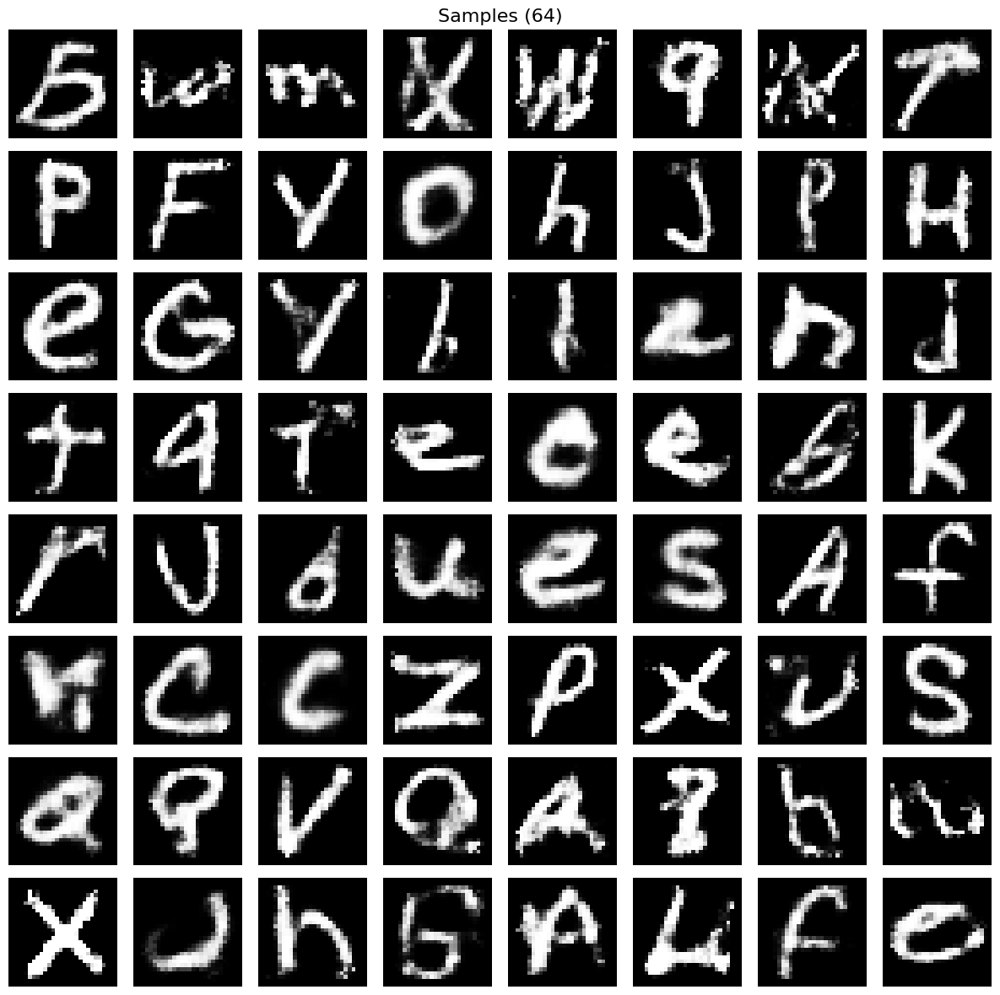
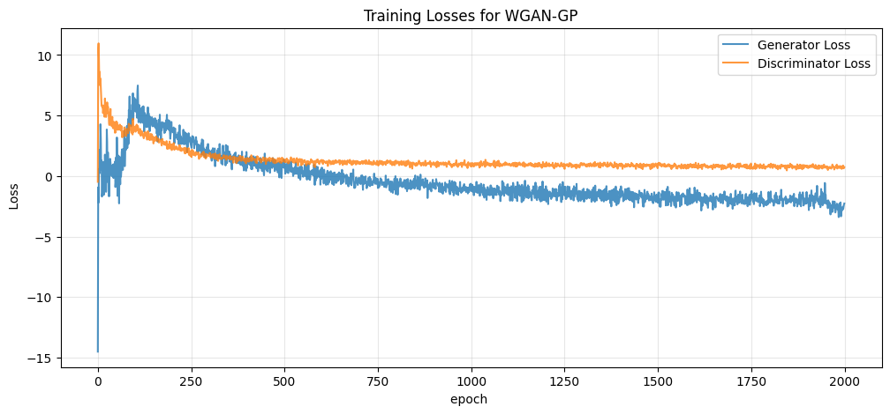
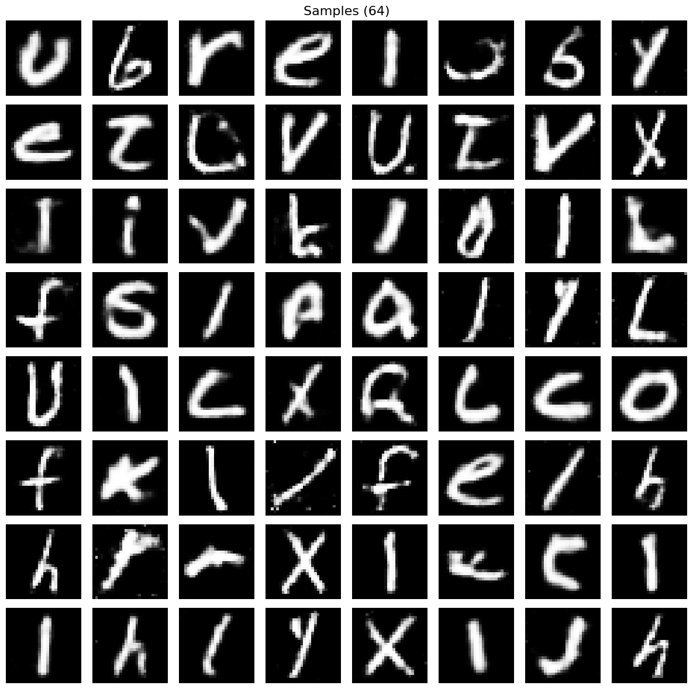
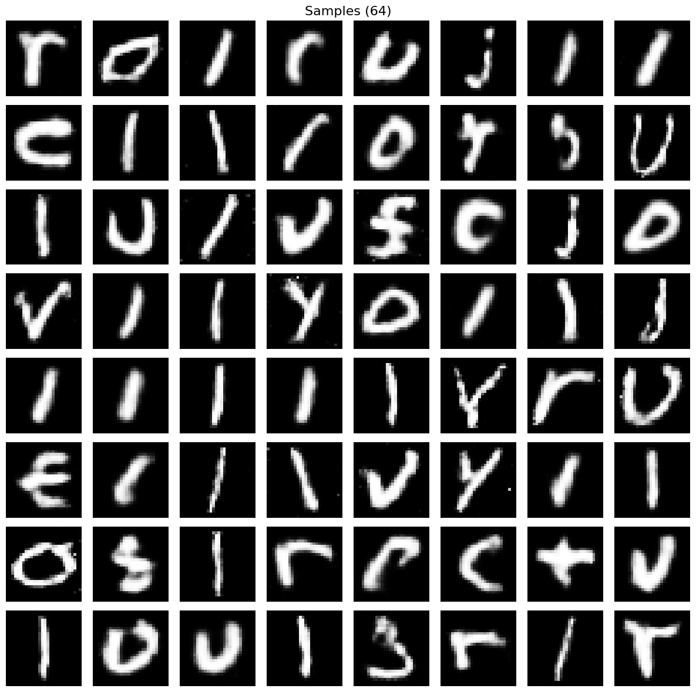
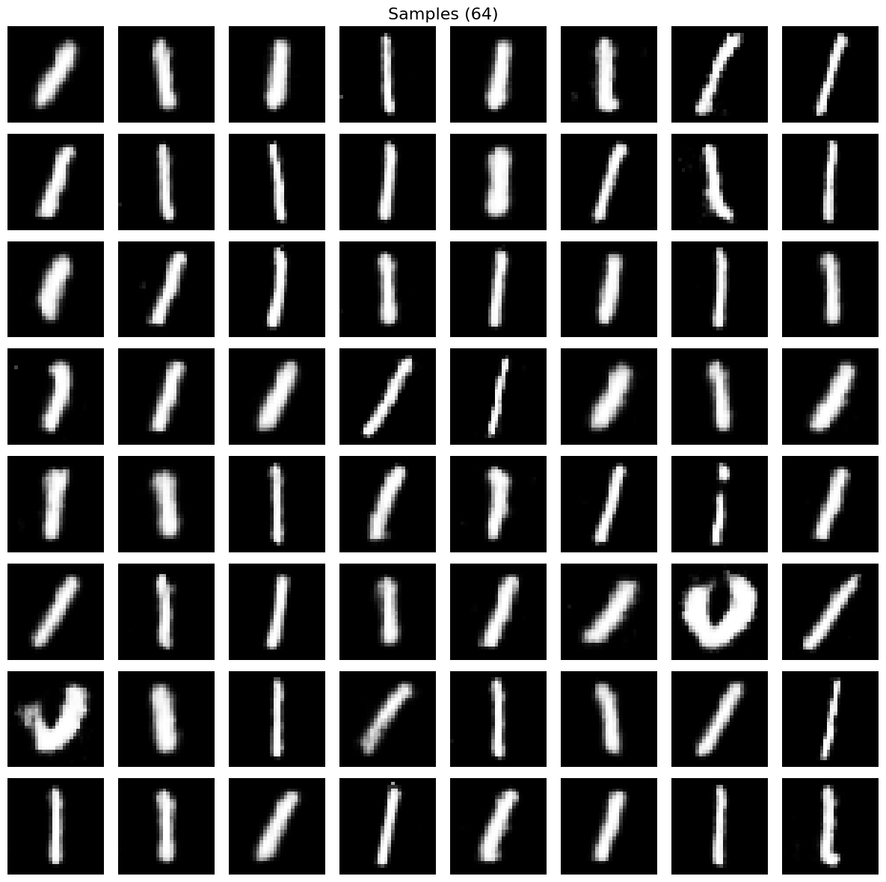
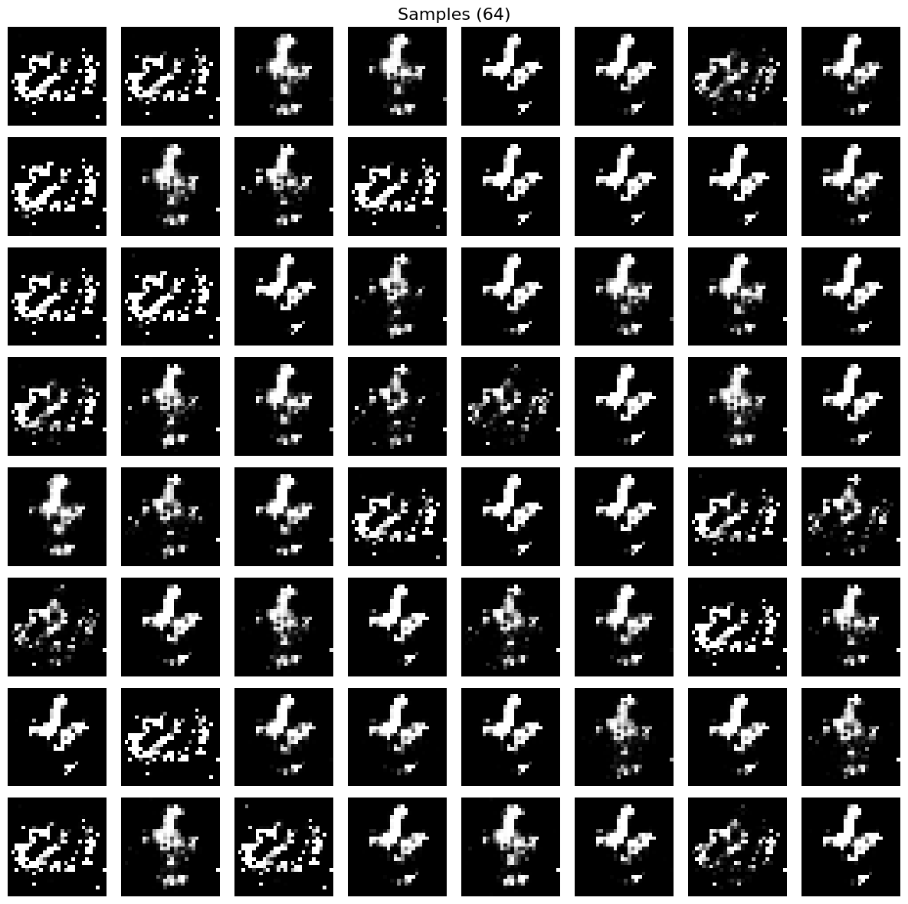

# GANs: Vanilla → WGAN → WGAN-GP

Generative adversarial networks implemented from scratch in PyTorch —
generator, discriminator, the adversarial objectives and the gradient penalty
all written from the papers rather than pulled from a library.

The point of the repo is the progression: train a vanilla MLP GAN until it
collapses, then show that the Wasserstein objective with a gradient penalty
fixes it.

<p align="center">
  
  <br>
  <sub>Samples after 2000 epochs of WGAN-GP — no sign of mode collapse</sub>
</p>

### Training loss

<p align="center">
  
  <br>
  <sub>Critic and generator loss for WGAN-GP. Unlike the BCE objective, the
  negative critic loss tracks an estimate of the Wasserstein distance, so it
  actually correlates with sample quality.</sub>
</p>

---

## What's implemented

Everything below is written directly in this repo:

- **Vanilla GAN** — MLP generator (100 → 4096 → 1024 → 256 → 784, LeakyReLU,
  `tanh` output) and MLP discriminator (784 → 400 → 144 → 16 → 1) trained
  against the standard minimax objective under binary cross-entropy.
- **WGAN critic** — the same architecture with the sigmoid removed, so the
  network outputs an unbounded score rather than a probability.
- **Wasserstein objective** — critic maximises `D(x) − D(G(z))`; generator
  minimises `−D(G(z))`, with `n_critic = 5` critic steps per generator step.
- **Gradient penalty** — written by hand with `torch.autograd.grad`: one
  interpolation coefficient per sample, gradients taken with respect to the
  interpolate, penalised as `(‖∇‖₂ − 1)²` and weighted by `λ = 10`.
- **Weight clipping** — the original WGAN constraint (`c = 0.01`), kept in the
  trainer for comparison and superseded by the gradient penalty.
- **Weight initialisation** — `N(0, 0.02)` across all linear layers, following
  the DCGAN convention.

---

## Results

### Objective vs. mode collapse

| Model | Objective | Critic steps | Epochs | Mode collapse |
|---|---|---|---|---|
| Vanilla GAN | BCE (minimax) | 1 | 2000 | **Yes** — collapses to a few modes |
| WGAN-GP | Wasserstein + λ‖∇‖ penalty | 5 | 2000 | **No** |

### Mode collapse in the vanilla GAN

The vanilla GAN trains stably at first, then the generator narrows onto a
small number of outputs while the discriminator keeps winning. The sequence
below shows that progression across training.

<p align="center">
  
  
  
  <br>
  <sub>Progression of mode collapse — samples become increasingly similar as
  training continues</sub>
</p>

<p align="center">
  
  <br>
  <sub>[Weird Mode Collapse 😬]</sub>
</p>

---

## Configuration

| | Vanilla GAN | WGAN-GP |
|---|---|---|
| Dataset | EMNIST Letters, 28×28 | EMNIST Letters, 28×28 |
| Latent dim | 100 | 100 |
| Generator | MLP, 4 layers | MLP, 4 layers |
| Discriminator/critic | MLP, 4 layers + sigmoid | MLP, 4 layers, no activation |
| Loss | BCE | Wasserstein + gradient penalty |
| λ (penalty weight) | — | 10 |
| `n_critic` | 1 | 5 |
| Batch size | 128 | 128 |
| Optimiser | Adam | Adam (in place of RMSProp) |
| Learning rate | D 1e-4 · G 2.5e-4 | 1e-4 (both) |
| Betas | (0.5, 0.999) | (0.0, 0.9) |
| Epochs | 2000 | 2000 |
| Weight init | `N(0, 0.02)` | `N(0, 0.02)` |
| Hardware | [1× RTX A2000 12GB] | [1× RTX A2000 12GB] |

---

## Repository layout

```
Model/vanillaGAN.py            # Generator + sigmoid discriminator
Model/WGAN.py                  # Generator + unbounded critic
Trainer/Trainer.py             # BCE adversarial training loop
Trainer/WasserstienTrainer.py  # WGAN-GP loop with gradient penalty
Notebooks/infer.ipynb          # Load a checkpoint and sample
ModeCollapse/                  # Vanilla GAN outputs showing collapse
WGAN-Generated/                # WGAN-GP outputs
```

---

## Usage

Place `emnist-letters-train.csv` in the working directory, then:

```bash
python Trainer/Trainer.py              # vanilla GAN
python Trainer/WasserstienTrainer.py   # WGAN-GP
```

Pixels are scaled to `[-1, 1]` to match the generator's `tanh` output.
Checkpoints store both networks, both optimiser states and the loss histories,
so a run can be resumed or sampled from directly. For sampling, open
`Notebooks/infer.ipynb` and point it at a checkpoint.

---

## Notes

- Adam with `β₁ = 0` is used in place of the RMSProp of the original WGAN
  paper, following the WGAN-GP authors' setup.
- Weight clipping is left in `WasserstienTrainer.py` (commented) rather than
  deleted, so the two constraint strategies can be compared directly.
- The gradient penalty roughly triples the cost of a critic step, since it
  requires a second backward pass through the critic.
- Both models are MLPs rather than convolutional — the aim was the objectives
  and the failure mode.
- Dataset was MNIST Letters.
- Weights are not included as file size to large for GitHub. Can be requested.
- DCGAN variants for WGAN and GAN are in a private repo

## References

- Goodfellow et al. (2014), *Generative Adversarial Networks* — [arXiv:1406.2661](https://arxiv.org/abs/1406.2661)
- Arjovsky et al. (2017), *Wasserstein GAN* — [arXiv:1701.07875](https://arxiv.org/abs/1701.07875)
